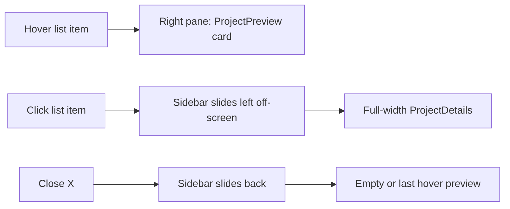

# Hover Preview + Full-Width Project Details

## Target interaction



- **Idle / hover:** left sidebar + right preview pane (Figma `144:630`)
- **Selected:** sidebar animates out; details occupy full width (Figma `164:227`)
- **Close:** reverse — sidebar returns; details unmount

## 1. Project metadata data model

Extend [`src/data/projects.ts`](src/data/projects.ts):

```ts
export type ProjectMeta = {
  company?: string;
  timeline?: string;
  type?: string;
  client?: string;
  role?: string;
};
// on Project: meta?: ProjectMeta
```

- Fill **Conversation Insights** from Figma: RozieAI / Q3 2024–Q3 2025 / Intern Tool / Air Canada / Product Designer
- Add placeholder `meta` for other projects (empty or minimal so UI can omit missing fields)
- Pass `meta` through `DetailItem` in [`src/data/details.ts`](src/data/details.ts) so details/preview don’t need a second lookup
- Keep markdown front-matter meta in [`conversation-insights.md`](src/data/case-studies/conversation-insights.md) in sync, or stop rendering meta from markdown once UI reads from `Project.meta` (prefer **single source: `Project.meta`**)

## 2. Rewire page orchestration

Update [`src/app/page.tsx`](src/app/page.tsx) + [`src/app/home.css`](src/app/home.css):

- Restore `activeItem` (hover) state separate from `selectedItem` (click)
- Wire Sidebar `onActivate` / `onDeactivate` (mouse enter/leave + focus/blur) on work list items only
- Right pane:
  - `selectedItem` → `ProjectDetails`
  - else → `ProjectPreview` with `activeItem`
- Layout class when selected (e.g. `home-layout is-details-open`): animate sidebar `width`/`x` to 0 (overflow hidden), expand details to full width via `motion` or CSS transition
- Add motion tokens in [`src/motion.ts`](src/motion.ts) for sidebar exit/enter (spring, matching existing sidebar motion feel)

## 3. Sidebar: hover handlers, remove project-mode UI

Update [`src/components/Sidebar/Sidebar.tsx`](src/components/Sidebar/Sidebar.tsx) + [`SidebarListItem`](src/components/SidebarListItem/SidebarListItem.tsx):

- Add hover/focus activate/deactivate for project rows
- **Remove** project-selected mode: “Back to Projects”, About-tab collapse, and in-sidebar “Project Sections” list — sidebar is off-screen while details are open
- Keep Work / About tabs as the only sidebar chrome

## 4. ProjectPreview → Figma card (`144:630`)

Rebuild [`src/components/ProjectPreview/ProjectPreview.tsx`](src/components/ProjectPreview/ProjectPreview.tsx) + CSS:

- White card, 8px radius, light border/shadow
- Top: media (existing video / gray placeholder / coming-soon fallback)
- Below: title (24px medium)
- 5-column meta row: Company, Timeline, Type, Client, Role (skip empty fields; use CSS grid)
- Preview only while hovering and nothing selected

## 5. ProjectDetails → full-width Figma (`164:227`)

Update [`ProjectDetails`](src/components/ProjectDetails/ProjectDetails.tsx) + CSS:

- Full-width when sidebar hidden; centered content column (`max-width` ~720px for text/meta; wider banner ~1015px as in Figma)
- Hero media + title + **details meta grid (2×2: Company, Timeline, Client, Role)** from `item.meta` — not from markdown
- Keep Quick Read / Deep Dive + case study body below a divider
- Tighten spacing/padding to match frame (80px vertical rhythm, 40px section gaps)

### Sections dropdown in navbar

Uncomment/wire [`TextDropdown`](src/components/TextDropdown/TextDropdown.tsx) in [`ProjectDetailsNavbar`](src/components/ProjectDetailsNavbar/ProjectDetailsNavbar.tsx):

- Turn into a real menu (or small popover) listing `getProjectSections(item.id)`
- Selecting a section: switch to deep-dive + `scrollIntoView` (reuse existing `sectionTarget` flow, but owned by details/navbar instead of sidebar)
- Move `activeSectionId` / section targeting so Sidebar no longer needs section props

### Case study content → closer Figma match

Update [`CaseStudyContent`](src/components/CaseStudyContent/CaseStudyContent.tsx) + CSS:

- Stop rendering the markdown `**Label:** value` meta block in the article (meta lives under title in ProjectDetails / Preview)
- Align section pattern to Figma: H2 = blue uppercase label; **first paragraph after H2** = 20px medium section headline; following paragraphs = body
  - Implement via custom markdown components (promote first `p` after each `h2`, or a small preprocess step)
- Callouts: left blue border + blue text (existing `blockquote` → refine to match)
- Dividers (`---`), figure captions, H3/list spacing, content max-width — polish to frame
- Adjust markdown only if structure blocks the H2 → headline pattern (prefer renderer change over rewriting all copy)

## 6. Out of scope / defaults

- No new routes / URL sync
- About / Writings: no hover preview
- Mobile (`≤1100px`): stack layout; when details open, hide sidebar similarly (collapse height/visibility) rather than a horizontal slide if width animation is awkward
- Placeholder meta for non–Conversation Insights projects; preview shows whatever fields exist

## Key files

| Area | Files |
|------|--------|
| Orchestration | `src/app/page.tsx`, `home.css`, `motion.ts` |
| Data | `projects.ts`, `details.ts` |
| Preview | `ProjectPreview/*` |
| Details | `ProjectDetails/*`, `ProjectDetailsNavbar/*`, `TextDropdown/*`, `CaseStudyContent/*` |
| Sidebar | `Sidebar/*`, `SidebarListItem/*` |
