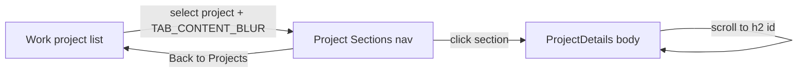

# Project Sections Sidebar

## Design intent (Figma as layout reference)
From [Figma node 148:634](https://www.figma.com/design/7SObhe2tsBTV67x9WcOPsp/Portfolio?node-id=148-634): identity header stays; primary nav becomes a single **Back to Projects** tab; content becomes **Project Sections** + a numbered list with **no icons and no chevrons**.

Trust codebase tokens/components over Figma (Inter, 16px, Tailwind utilities, etc.). Reuse existing [`Sidebar`](src/components/Sidebar/Sidebar.tsx), [`SidebarTab`](src/components/SidebarTab/SidebarTab.tsx), [`SidebarListItem`](src/components/SidebarListItem/SidebarListItem.tsx), spacing/colors from [`globals.css`](src/app/globals.css) / [`Sidebar.css`](src/components/Sidebar/Sidebar.css).

Section titles come from case-study `##` headings in markdown (not Figma’s shortened copy). For Conversation Insights that means: Overview, System Problem, Discovery & Insights, Constraints, Early Designs, Learnings from User Test Sessions, Solution, Outcomes, Reflection.

## 1. Extend `SidebarListItem` for section rows
Update [`SidebarListItem.tsx`](src/components/SidebarListItem/SidebarListItem.tsx) / CSS:

- Add `showIcon?: boolean` (default `true`) and `showChevron?: boolean` (default `true`).
- Make `item.icon` optional when `showIcon` is false.
- Add optional `number?: number`. When set, render label as `{number}. {title}` (always used for project sections).

Project/about rows keep current behavior (icon + chevron, no number).

## 2. Derive sections from case study markdown
In [`src/data/case-studies/index.ts`](src/data/case-studies/index.ts):

- Add `getCaseStudySections(markdown)` → `{ id, title }[]` from `##` headings.
- `id` = slug of the heading (e.g. `discovery-insights`) for scroll targets.
- Export a helper `getProjectSections(projectId)` that returns `[]` when no case study exists.

## 3. Sidebar: project-selected view + same blur animation
In [`Sidebar.tsx`](src/components/Sidebar/Sidebar.tsx):

- When `selectedItem?.kind === "project"`, render the project-sections UI instead of Work/About/Writings lists.
- Header identity unchanged.
- Nav: one `SidebarTab` labeled **Back to Projects** (`isActive`), `onClick` → `onSelectItem(null)` (same as clearing selection / closing details).
- Content: section label **Project Sections** + `SidebarListItem` list with `showIcon={false}`, `showChevron={false}`, `number={index + 1}`.
- Keep `AnimatePresence` + `TAB_CONTENT_BLUR_VARIANTS`. Change the motion key so the transition fires between project list and sections, e.g. `key={selectedItem?.kind === "project" ? \`sections-${selectedItem.id}\` : activeTab}`.

Only projects enter this view (not About items).

## 4. Scroll-to-section wiring
Sibling components need a shared target via [`page.tsx`](src/app/page.tsx):

```tsx
const [sectionTarget, setSectionTarget] = useState<string | null>(null);
```

- Sidebar section click → `setSectionTarget(section.id)`.
- Pass `sectionTarget` into `ProjectDetails`.
- In [`ProjectDetails.tsx`](src/components/ProjectDetails/ProjectDetails.tsx):
  - On `sectionTarget`, set view mode to **deep-dive** (so non-Overview sections exist in the DOM).
  - After content paints, `scrollIntoView` / scroll `.project-details-body` to `#section-{id}` (smooth).
  - Clear target via callback after scroll so repeat clicks still work.

## 5. Anchor IDs on case study headings
In [`CaseStudyContent.tsx`](src/components/CaseStudyContent/CaseStudyContent.tsx), customize `h2` to render with `id` from the same slug helper used for sections (so sidebar IDs match). Keep skipping `h1` as today.

## Flow



## Out of scope
- Renaming MD headings to match Figma (“Impact”, short “Learnings”).
- Scroll-spy / auto-updating active section while scrolling (click sets `isActive` only).
- New visual design system beyond existing sidebar list-item styles.
