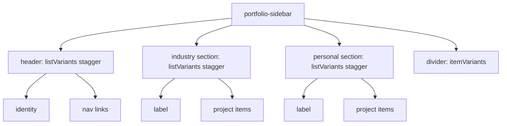

# Sidebar staggered spring reveal

## Approach

Mirror the gzlang playground pattern from [`gz-language/website/src/motion.ts`](../gz-language/website/src/motion.ts) and [`SamplesSidebar.tsx`](../gz-language/website/src/components/SamplesSidebar/SamplesSidebar.tsx):

- Install `motion`
- Shared variants/constants in a small `src/motion.ts`
- Wire `motion` elements in [`Portfolio.tsx`](src/components/Portfolio/Portfolio.tsx) only — no layout/CSS redesign

## Motion params (exact)

```ts
SIDEBAR_BLUR = "8px"
SIDEBAR_ITEM_SPRING = { type: "spring", stiffness: 80, damping: 8, mass: 0.6 }
staggerChildren: 0.03
delayChildren: 0.04  // no parent intro reveal in this app
```

## What animates

Everything currently in `.portfolio-sidebar`, using the same `itemVariants` (opacity 0→1, y 60→0, blur 8px→0):

1. **Header group** (independent stagger parent): identity block + each nav link
2. **Industry group** (independent stagger parent): section label + each project list item
3. **Personal group** (independent stagger parent): section label + each project list item
4. **Divider**: same `itemVariants` as a single motion element (self-contained reveal)

Future sidebar blocks follow the same pattern: wrap a group in `listVariants`, children in `itemVariants`.

## File changes

1. **Install** `motion` (`npm install motion`)
2. **Add** [`src/motion.ts`](src/motion.ts) with `SIDEBAR_BLUR`, `SIDEBAR_ITEM_SPRING`, `SIDEBAR_LIST_VARIANTS`, `SIDEBAR_ITEM_VARIANTS` (same API as gzlang)
3. **Update** [`src/components/Portfolio/Portfolio.tsx`](src/components/Portfolio/Portfolio.tsx):
   - Import `motion` from `motion/react` and the variants
   - Header → `motion.header` with `variants={listVariants}`, `initial="hidden"`, `animate="show"`, `custom={0.04}`; identity + nav links as `motion` children with `itemVariants`
   - Each project `<ul>` → `motion.ul` with the same list variants/custom; each `<li>` → `motion.li` with `itemVariants` (via `ProjectListItem`)
   - Section labels + divider → `motion` elements with `itemVariants` (labels included in their section’s stagger parent so each section cascades as a unit)
4. **Leave** [`Portfolio.css`](src/components/Portfolio/Portfolio.css) / preview / unrelated UI unchanged (filter/opacity on hover blur behavior stays as-is)

## Structure sketch



Each group starts its own cascade with `delayChildren: 0.04` — not one continuous sequence across the whole sidebar.
