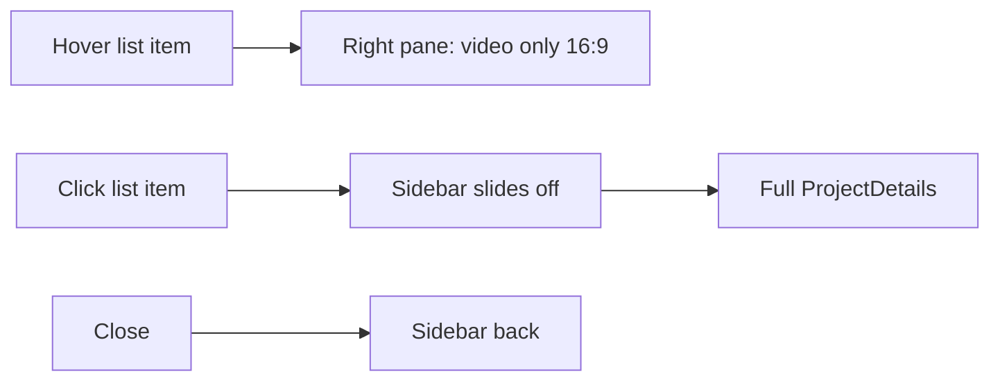

# Video-Only Hover Preview

## Target interaction

- **Hover / focus** (`activeItem`): show [`ProjectPreview`](src/components/ProjectPreview/ProjectPreview.tsx) — video (or “coming soon”) only, in a **16:9** container. No title, meta, or tagline.
- **Click** (`selectedItem`): keep current fullscreen details behavior — sidebar hides, [`ProjectDetails`](src/components/ProjectDetails/ProjectDetails.tsx) with all content + close.
- Selection still wins over hover (`selectedItem ?? activeItem`).

## Changes

### 1. Wire preview vs details in [`src/app/page.tsx`](src/app/page.tsx)

Today both hover and click mount `ProjectDetails`. Change the stage to:

- If `selectedItem` → `ProjectDetails` (current props/close/sections)
- Else if `activeItem` → `ProjectPreview` with that item
- Else → empty stage

Keep `isFullscreen` / `is-details-open` tied only to selected project click.

### 2. Strip preview to video-only in [`ProjectPreview.tsx`](src/components/ProjectPreview/ProjectPreview.tsx) + [`ProjectPreview.css`](src/components/ProjectPreview/ProjectPreview.css)

- Remove title, meta (`getPreviewMetaFields`), and tagline from the preview markup.
- Keep muted/loop/autoplay video + “coming soon” fallback + existing `mediaTone` backdrop.
- Force the media box to `aspect-ratio: var(--media-aspect-ratio)` (**already `16 / 9` in [`globals.css`](src/app/globals.css)**).
- Video fills the box with `object-fit: cover` (or contain if you already prefer letterboxing — default **cover** so the 16:9 frame stays solid).
- Drop unused card/info/meta styles; keep a simple centered stage layout (no card chrome required for video-only).

### 3. Leave details as the full content surface

No change to case study / navbar / meta in `ProjectDetails` — that remains the click destination.

## Out of scope

- Per-project 4:3 ratios
- New Figma redesign beyond video-only hover + existing click details
- Changing sidebar list hover/click wiring (already correct via `onActivate` / `onSelect`)
